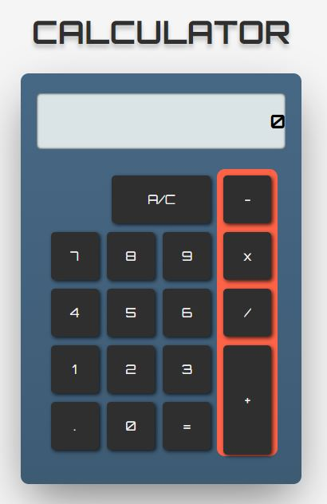

### Open for work

<div id="badges" align="center">
  
  
</div>

# Calculator

Functional calculator with basic mathematical operators
It can chain multiple operations back to back

### Languages and Tools

<div align="center">
  &nbsp;
  &nbsp;
  &nbsp;
  &nbsp;
</div>

## Installation

```bash
  git clone
  cd calculator
```

## Demo

Demo is hosted on https://fabio-writes-code.github.io/calculator/



## Contributing

Contributions are always welcome!

Please adhere to this project's `code of conduct`.
